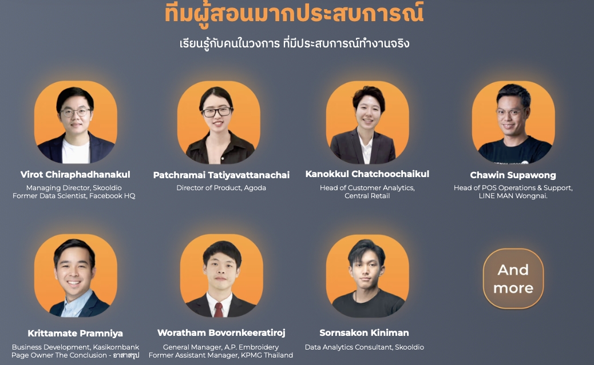
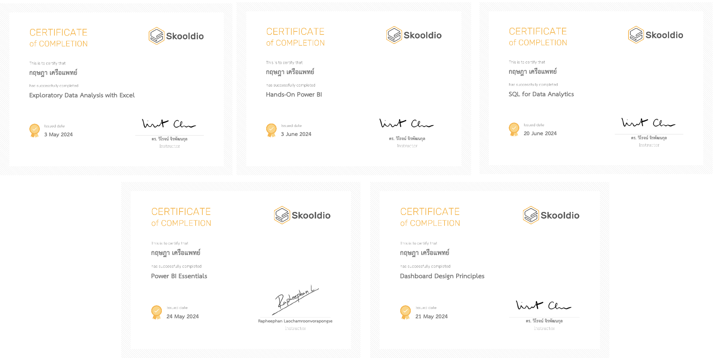

# Data Analysis & Analysis Engineer Portfolio
Welcome to my Data Analysis & Analysis Engineer Portfolio! this is my skills and accomplishments in the field of data analysis. Below is a summary of the key certifications I have obtained, demonstrating my commitment to continuous learning and professional development in data analysis and analysis engineer

# Skooldio Data Analysis BoostCamp 8th (not finish yet):

#### instructor: 

### Certifications:

### Certifications
1. **Dashboard Design Principles**
   - **Issued By:** Dr. Wiroj Jirapattanakul
   - **Date:** May 21, 2024
   - **Description:** This certification covers the fundamental principles of designing effective and insightful dashboards. It emphasizes the importance of visual storytelling and user-friendly interfaces to convey complex data clearly and effectively.

2. **Power BI Essentials**
   - **Issued By:** Rapheepan Laochamroonvorapongse
   - **Date:** May 24, 2024
   - **Description:** This course provided comprehensive training in Power BI, focusing on data visualization, dashboard creation. It equipped me with the skills to transform raw data into actionable insights using Power BI's powerful features.

3. **Hands-On Power BI**
   - **Issued By:** Dr. Wiroj Jirapattanakul
   - **Date:** June 3, 2024
   - **Description:** This practical course allowed me to apply my Power BI knowledge in real-world scenarios. It involved creating dynamic reports and dashboards, enabling me to enhance my data visualization and analytical capabilities.
   - **HandOnWorkshop:** https://github.com/kkowenn/MasterPowerBI
     
4. **SQL for Data Analytics**
   - **Issued By:** Dr. Wiroj Jirapattanakul
   - **Date:** June 20, 2024
   - **Description:** This certification focused on the use of SQL for data extraction, manipulation, and analysis. It covered concept SQL queries, preparing me to handle large datasets efficiently.

5. **Exploratory Data Analysis with Excel**
   - **Issued By:** Dr. Wiroj Jirapattanakul
   - **Date:** May 3, 2024
   - **Description:** This course taught me the techniques of exploratory data analysis (EDA) using Excel. It covered data cleaning, visualization, and statistical analysis, allowing me to uncover patterns and insights in data using Excel's robust analytical tools.

**Final Work from this boostcamp**
https://github.com/kkowenn/FastworkAnalysisProject

dashboard in webapp version:

https://github.com/kkowenn/streamlit_dashboard_webapp

https://github.com/kkowenn/DataBaseProjects
# DataTH Analysis Engineer boostcamp:

### Certifications
1. **Tools For Analysis engineer**
   - **Issued By:** Perth Woratana Ngarmtrakulchol
   - **Date:** Jul 8, 2024
### **Description:** 
This certification covers the fundamental of this tools below:
   - Automated data extraction without writing code for Data Pipelines using **Fivetran and Airbyte**.
   - Managing entire data systems through code and running them automatically to eliminate human errors (Fat Finger Errors) using **Terraform**.
   - Performing Data Transformation with SQL in an organized manner, ensuring data quality tests with **dbt**.
   - Storing data in a Data Warehouse that seamlessly connects with a Data Lake, using **Snowflake and Databricks**.
   - Using **Modern Data Stack tools** learned in the course to work with data from start to finish.
   - Exploring new and interesting data concepts such as **Data Lakehouse, Data Mesh, Data Contracts, etc**.
   - And other interesting data-related topics, with this course focusing on **globally recognized tools and concepts in the data field.**

## About Me
I am a passionate data analyst with a strong background in data visualization, SQL, and exploratory data analysis. My certifications reflect that I have skills in the latest tools and techniques, such as Fivetran, Airbyte, Terraform, dbt, Snowflake, and Databricks. I am learning about Analysis Engineer tools & Concepts, automating data pipelines, managing systems to eliminate errors, ensuring data quality, and exploring modern concepts like Data Lakehouse and Data Mesh. 
This combination of skills enables me to handle complex data projects from start to finish, ensuring accuracy, efficiency, and actionable insights. 
