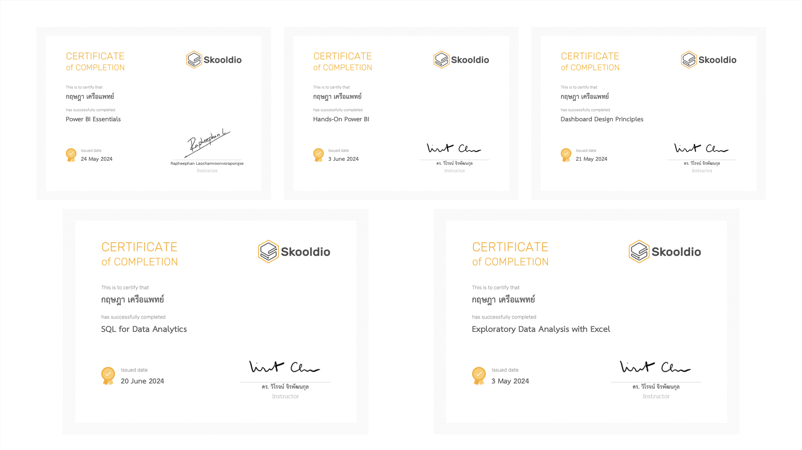

# Data Analysis Portfolio
Welcome to my Data Analysis Portfolio! I am thrilled to showcase my skills and accomplishments in the field of data analysis. Below is a summary of the key certifications I have obtained, demonstrating my commitment to continuous learning and professional development in data analysis.

### Data Analysis BoostCamp(not finish yet) instructor: 

### Certifications:

### Certifications
1. **Dashboard Design Principles**
   - **Issued By:** Dr. Wiroj Jirapattanakul
   - **Date:** May 21, 2024
   - **Description:** This certification covers the fundamental principles of designing effective and insightful dashboards. It emphasizes the importance of visual storytelling and user-friendly interfaces to convey complex data clearly and effectively.

2. **Power BI Essentials**
   - **Issued By:** Rapheepan Laochamroonvorapongse
   - **Date:** May 24, 2024
   - **Description:** This course provided comprehensive training in Power BI, focusing on data visualization, dashboard creation, and data modeling. It equipped me with the skills to transform raw data into actionable insights using Power BI's powerful features.

3. **Hands-On Power BI**
   - **Issued By:** Dr. Wiroj Jirapattanakul
   - **Date:** June 3, 2024
   - **Description:** This practical course allowed me to apply my Power BI knowledge in real-world scenarios. It involved creating dynamic reports and dashboards, enabling me to enhance my data visualization and analytical capabilities.
   - **HandOnWorkshop:** https://github.com/kkowenn/MasterPowerBI
     
4. **SQL for Data Analytics**
   - **Issued By:** Dr. Wiroj Jirapattanakul
   - **Date:** June 20, 2024
   - **Description:** This certification focused on the use of SQL for data extraction, manipulation, and analysis. It covered advanced SQL queries, database management, and integration of SQL with other data analysis tools, preparing me to handle large datasets efficiently.

5. **Exploratory Data Analysis with Excel**
   - **Issued By:** Dr. Wiroj Jirapattanakul
   - **Date:** May 3, 2024
   - **Description:** This course taught me the techniques of exploratory data analysis (EDA) using Excel. It covered data cleaning, visualization, and statistical analysis, allowing me to uncover patterns and insights in data using Excel's robust analytical tools.

### About Me

I am a passionate data analyst with a strong background in data visualization, SQL, and exploratory data analysis. My certifications reflect my dedication to mastering the tools and techniques necessary to transform data into meaningful insights. Through practical experience and continuous learning, I strive to deliver high-quality data analysis that drives informed decision-making.

Feel free to explore my portfolio to see examples of my work and how I apply my skills to solve real-world problems.

https://github.com/kkowenn/webScrapeAndDATAprep
