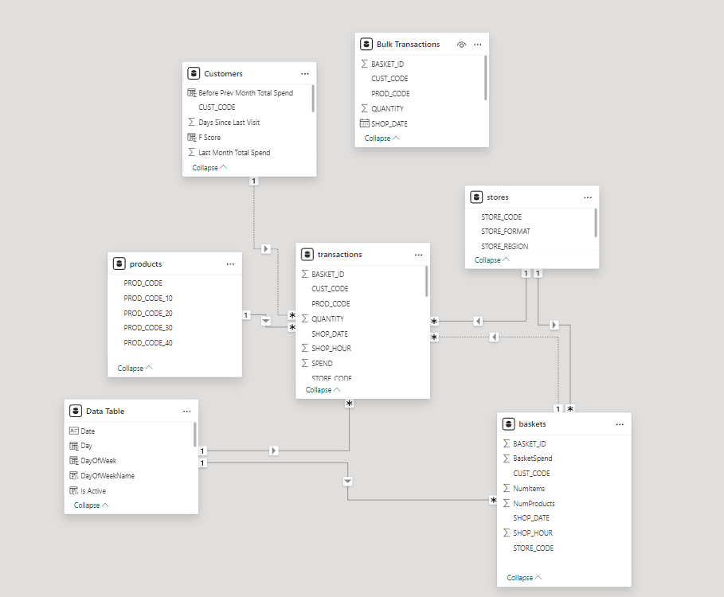
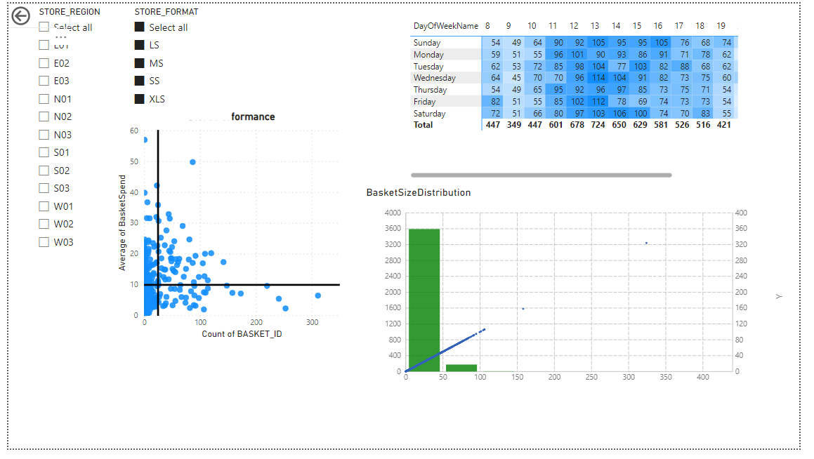
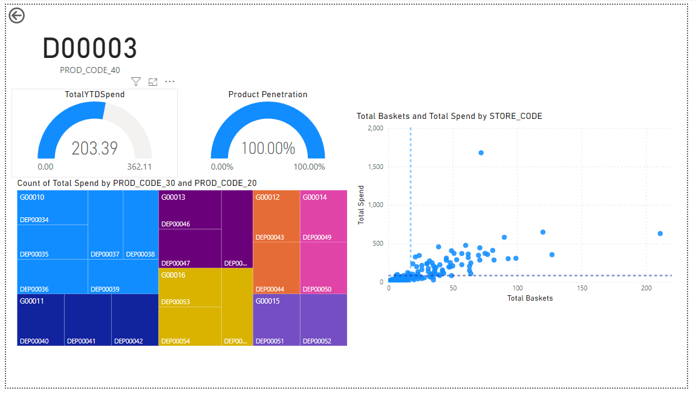
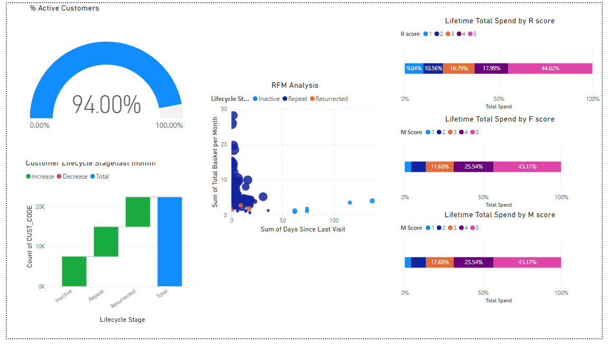

# DataAnalyticsPortfolio

I didn't intend to infringe on copyright, and I'm not teaching how to do it either. But I made a portfolio for this subject. If you're interested or want to learn more, I recommend taking the course at Skooldio. It's a lot of fun! but in Thai language

ไม่ได้ตั้งจะละเมิดลิขสิทธิ์ และไม่สอนทำด้วย แต่ทำพอร์ต
สนใจหรืออยากรู้วิชา แนะนำไปเรียนที่เลยจร้าาา สนุกมาก 

# acknowledgement by :

- https://www.skooldio.com/courses/power-bi-essentials
- https://www.skooldio.com/courses/hands-on-power-bi

### All table (Model view) 

# Dashborads:
### Sales Overview dashboard

### Store Overview dashboard

### Product Overview dashboard

### Customer Overview dashboard

